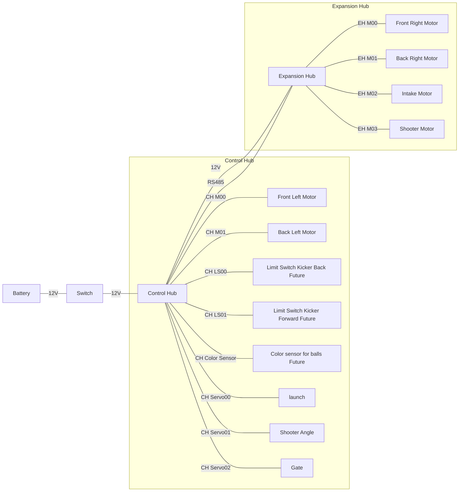

```mermaid
graph LR
    CH[Control Hub]
    EH[Expansion Hub]
    BAT[Battery]
    SW[Switch]

    BAT -- 12V --- SW -- 12V --- CH -- 12V --- EH
    CH -- RS485 --- EH
 
    subgraph Control Hub

    M01[Front Left Motor]
    M02[Back Left Motor]
    LS00[Limit Switch Kicker Back Future]
    LS01[Limit Switch Kicker Forward Future]
    Color[Color sensor for balls Future]
    Servo00[launch]
    Servo01[ Shooter Angle]  
    Servo02[Gate]

    CH --CH M00--- M01
    CH --CH M01--- M02
    CH --CH LS00--- LS00
    CH --CH LS01--- LS01
    CH --CH Color Sensor--- Color
    CH --CH Servo00--- Servo00
    CH --CH Servo01--- Servo01
    CH --CH Servo02--- Servo02   
    end

    subgraph Expansion Hub

    EH --EH M00--- M05[Front Right Motor]
    EH --EH M01--- M06[Back Right Motor]
    EH --EH M02--- M07[Intake Motor]
    EH --EH M03--- M08[Shooter Motor]

    end

```
limit switch - LS00 
- Black - GND
- White - Signal

Limit switch - LS01
- Black - GND 
- Blue - Signal

Pin 1 - GND
Pin 2 - 3.3V
Pin 3 - LS00(White)

Pin 4 - LS01(Blue)

